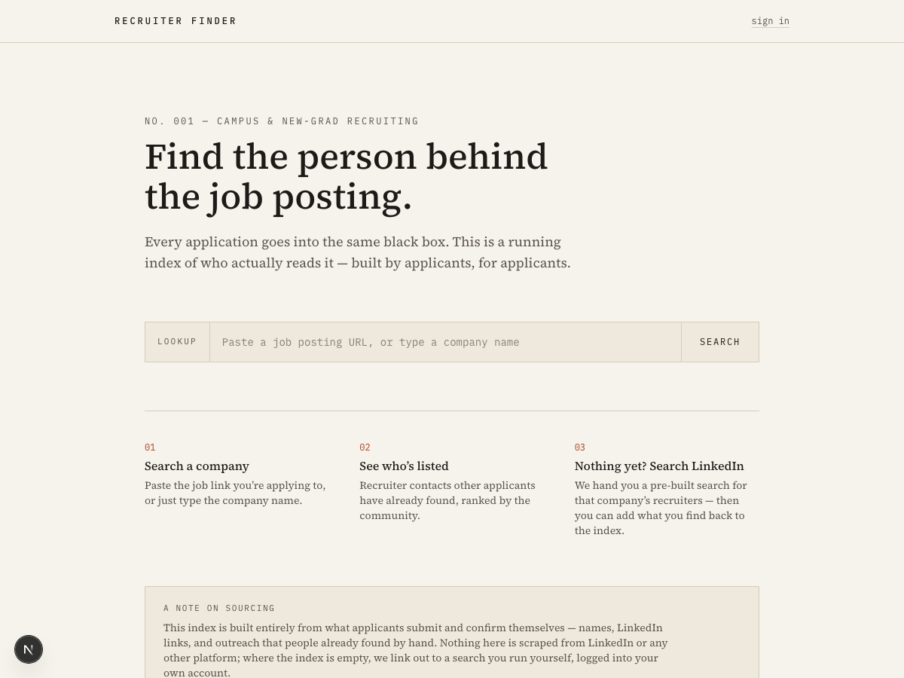

# Recruiter Finder

Every new-grad application goes into the same black box: an ATS that may or
may not have a human on the other end. **Recruiter Finder** is a
crowdsourced index that answers one question — *for this company, who
actually reads the resume?*



## How it works

1. **Search a company.** Paste the job posting URL you're applying to, or
   just type the company name.
2. **See who's listed.** Recruiter contacts other applicants have already
   found and confirmed, ranked by community upvotes.
3. **Nothing yet? Search LinkedIn.** If no one has added a contact, the app
   hands you a pre-built LinkedIn search (e.g. `"Acme" university recruiter`)
   to run yourself — then you can add what you find back to the index.

## A note on sourcing

There is no legitimate way to automatically scrape LinkedIn for this data —
it violates LinkedIn's Terms of Service and sits in legally contested
territory (see *hiQ Labs v. LinkedIn*). So this project deliberately does
**not** scrape anything. Instead it leans on three tiers of sourcing, in
order of how much of the product they currently power:

1. **Crowdsourced contacts** — the core of the product. Applicants submit
   recruiter names/LinkedIn URLs they've already found by hand, and the
   community upvotes/flags them to keep the index accurate over time.
2. **LinkedIn search-assist** — when the index is empty for a company, the
   app generates a LinkedIn people-search deep link (company + role
   keywords like "university recruiter" or "early careers") that the user
   runs themselves, logged into their own account. Zero scraping.
3. **Paid enrichment APIs** (not yet implemented) — a future option once
   there's real usage: licensed data providers (e.g. Apollo.io, Hunter.io)
   operate under their own data agreements, which is a fundamentally
   different (and legitimate) model from scraping.

## Tech stack

- **[Next.js](https://nextjs.org) (App Router)** — React framework, server
  actions for all mutations (no separate REST/API layer).
- **[Supabase](https://supabase.com)** — Postgres database, auth (Google
  OAuth + email magic link), and row-level security.
- **Tailwind CSS v4** for styling.
- **Vercel** for deployment.

## Data model

Defined in [`supabase/schema.sql`](supabase/schema.sql):

| Table               | Purpose                                                             |
| ------------------- | -------------------------------------------------------------------- |
| `companies`         | One row per company; domain is case-insensitively unique.            |
| `contacts`          | A recruiter contact submitted against a company.                     |
| `contact_votes`     | One up/down vote per (contact, user) — powers the ranking.           |
| `contact_flags`     | User-reported "this is outdated/wrong" signals.                      |
| `company_requests`  | "This company needs a contact" markers when the index is empty.      |

A `contacts_with_score` view aggregates votes per contact for ranking. It's
declared `security_invoker` so it still enforces the row-level security
policies of the querying user rather than the view owner's.

Every table has row-level security enabled: anyone can read, but writes are
scoped to the authenticated user (`submitted_by = auth.uid()`, etc.), and
foreign keys to `auth.users` specify explicit `ON DELETE` behavior so
account deletion never gets silently blocked or corrupts the index.

## Running locally

1. **Clone and install:**

   ```bash
   git clone https://github.com/shawnbatnagar/recruiter-finder.git
   cd recruiter-finder
   npm install
   ```

2. **Create a [Supabase](https://supabase.com) project**, then in the SQL
   editor run [`supabase/schema.sql`](supabase/schema.sql) to create the
   tables, indexes, and RLS policies.

3. **Enable auth providers** in Supabase → Authentication → Providers:
   turn on Email (for magic links) and Google OAuth.

4. **Set environment variables** — copy `.env.example` to `.env.local` and
   fill in your Supabase project's URL and anon key:

   ```bash
   cp .env.example .env.local
   ```

5. **Run the dev server:**

   ```bash
   npm run dev
   ```

   Open [http://localhost:3000](http://localhost:3000).

## Roadmap

- `job_postings` table to track individual reqs per company, not just the
  company-level contact list.
- Paid enrichment API integration as an optional auto-suggest layer.
- Periodic "still accurate?" nudges to submitters after ~60 days, since
  recruiters change roles often.

## License

MIT — see [`LICENSE`](LICENSE).
